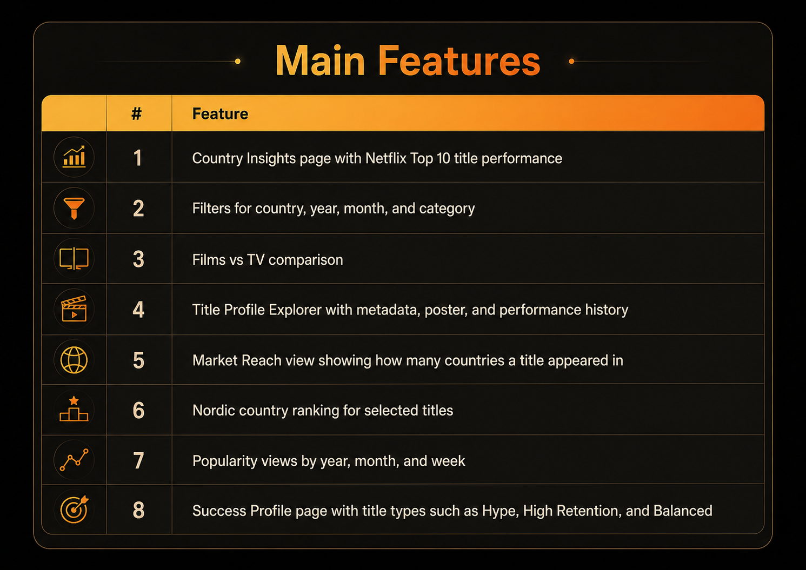
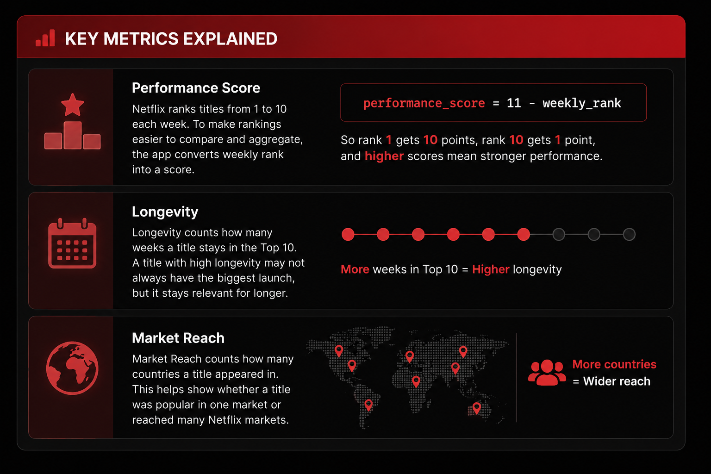

<p align="center">
  
</p>

<p align="center">
  <a href="https://netflix-top10-tudum-analysis.streamlit.app/">
    Open the Streamlit app
  </a>
</p>

## Demo Video
[Netflix_Streamlit_Aira.webm](https://github.com/user-attachments/assets/3cab68be-c002-4193-b723-66efc442b02b)


Streamly is a Streamlit dashboard that explores Netflix Top 10 / Tudum data. It helps users see which films and TV series perform well globally, how titles trend in different countries, and what kind of success pattern a title has.

I built this project from a Data Engineering and DRY (Don't Repeat Yourself) perspective: prepare the data, create reusable transformations, and present the results in a dashboard that is simple to use and easy to explain.





## Dataset

The data comes from Netflix Tudum Top 10 data and prepared project files in `src/netflix/assets/data/`.
- [Tudum Dataset Source](https://www.netflix.com/tudum/top10/most-popular)


## Code structure and DRY principles

The project follows DRY principles, which means **“Don’t Repeat Yourself.”** Instead of repeating the same chart code, HTML, colors, and styling in every page, I moved reusable logic into components. This makes the app easier to maintain because changes only need to be made in one place.

| Part | Responsibility |
| --- | --- |
| [`country_insights.py`](src/netflix/pages/country_insights.py) | Controls the page flow |
| [`country_sections.py`](src/netflix/components/country_sections.py) | Renders Streamlit page sections |
| [`country_charts.py`](src/netflix/components/country_charts.py) | Builds Plotly charts |
| [`utils/country_insights.py`](src/netflix/utils/country_insights.py) | Prepares and transforms data |
| [`theme.py`](src/netflix/components/theme.py) | Stores shared colors/constants |
| [`html/`](src/netflix/components/html/) | Stores reusable HTML templates |
| [`dashboard.css`](src/netflix/assets/style/dashboard.css) | Stores styling |

## Merics



## Folder structure
```
src/netflix/
├── app.py
├── pages/
│   ├── country_insights.py
│   └── success_profile.py
│
├── components/
│   ├── country_sections.py
│   ├── country_charts.py
│   ├── success_sections.py
│   ├── success_charts.py
│   ├── cards.py
│   ├── branding.py
│   ├── footer.py
│   ├── theme.py
│   └── html/
│
├── utils/
│   ├── helpers.py
│   ├── constants.py
│   ├── country_insights.py
│   └── success_profile.py
│
└── assets/
    ├── data/
    ├── image/
    └── style/
        ├── dashboard.css
        └── main.css
```

## How to run locally
[Setup guide](./docs/setup.md)

## Disclaimer / notes

This project is for learning, portfolio, and data storytelling purposes. It uses Netflix Top 10 / Tudum data to explore viewing trends, but it should not be treated as a complete picture of all Netflix viewing behavior.
